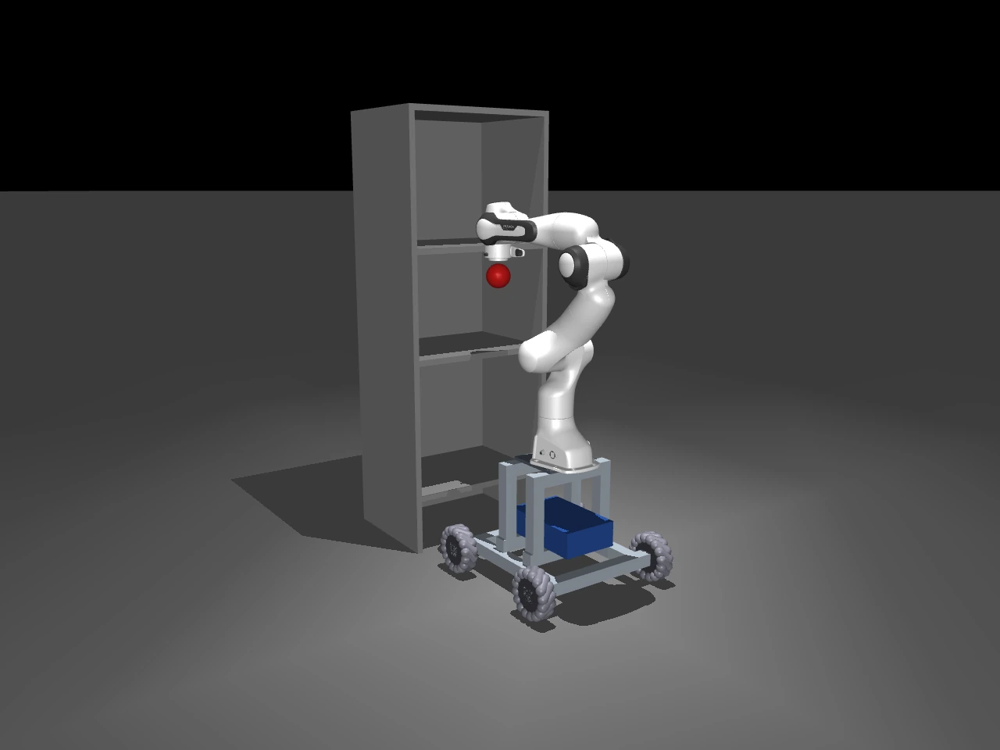
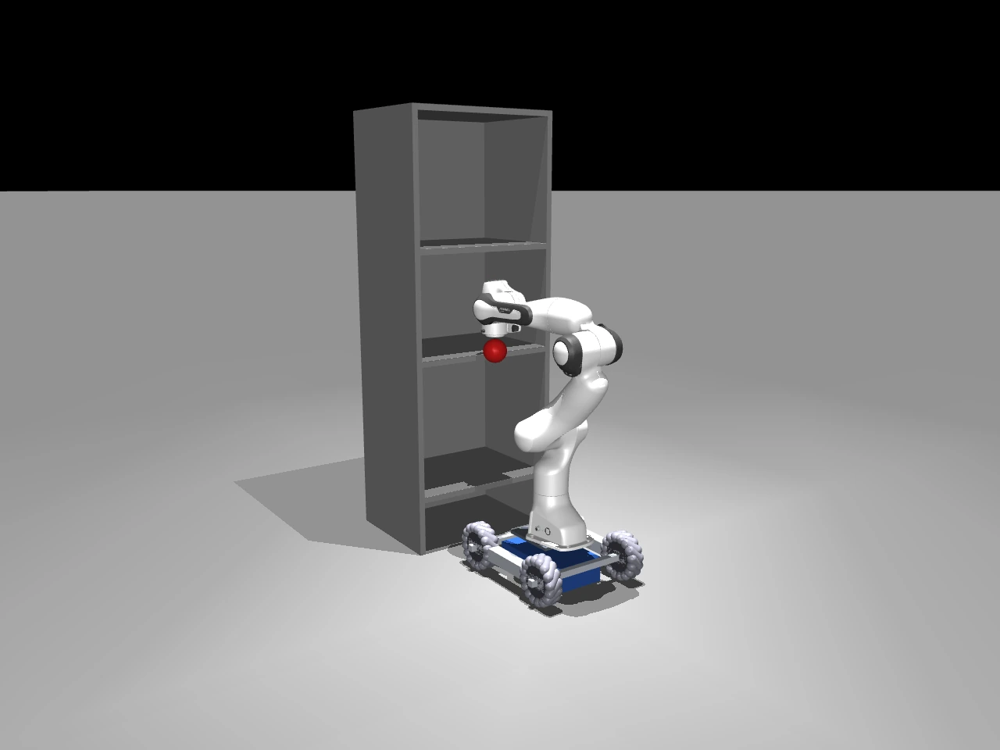

<!-- 编辑稿来源：blog/index.html；按当前工作区内容提取。 -->

> 编辑说明：下方「英文正文」保留原文，供直接修改；中文摘要仅帮助梳理结构，不回填网页。可增删段落、改标题与图注。`source` 注释用于定位原页面，建议保留。图片与视频仍使用原资产。修改英文正文、标题、图注或视频说明时，同时更新本文件与 `blog/index.html`，保持内容一致；本文件不自动生成或发布网页。图表的交互文案及数值若需改动，我会在回填时同步检查对应脚本与数据。

## 中文结构摘要（不回填）

- **核心问题**：通用 coding agents 能否在物理环境中完成观察、推理、决策、反思的闭环？RLE-Bench 以机器人学习工程师的工作评估这一能力。
- **任务体系**：9 个任务、4 类工作流，涵盖交互控制与具身推理、策略学习与部署、本体与协同设计、感知与估计。
- **评估方法**：在资源限制内构建、行动、观察、修正，再通过隐藏物理条件独立评估。
- **初步结果**：7 个系统的能力分布不均衡；视觉感知差异明显，运动策略学习差距较小，物理设计仍有基础性失败。T03、T05 尚未完成，Astra 的交互分数仅覆盖 T09，总指数的覆盖范围不一致。
- **三个深入分析**：T01 比较不同机器人接口的帮助；T02 检验一个 agent 制作的工具能否帮助另一个 agent；T06 展示看似合理的设计如何在物理测试中失败。
- **展望**：研究物理反馈如何改善实验、设计和可迁移工具，并补齐待测任务、轨迹分析、不确定性及资源成本。

---

<!-- 英文正文开始；以下内容用于回填 -->

# Introducing RLE-Bench

A qualifying exam for coding agents  as robot learning engineers

RLE-Bench tests whether general-purpose coding agents can operate as autonomous problem solvers in physically grounded environments. Agents must perceive, reason, experiment, write and revise code, and use feedback from simulation to improve their solutions.

RLE-Bench team Updated 9 September 2026 13 min read

9

**Engineering tasks**

4

**Workflow families**

48

**Total subtasks**

[View results and coverage](#results)

<!-- source: #task-video-carousel -->

<!-- 卡片标题置于视频下方：T01 · Agentic control 等；保留分类色点，去掉视频顶部标签与卡片右下角箭头。 -->

<!-- 顶部横向视频轮播：T01–T09；可见视频静音循环播放，以约 36px/s 持续横向往返滚动。支持左右按钮、触摸滑动和键盘操作；暂停按钮同时暂停视频与自动滚动，悬停、键盘聚焦或操作时暂缓自动滚动，离开或操作结束后恢复。减少动态效果偏好下默认暂停。点击卡片展开对应任务。T03 尚无视频。 -->

| Task | Preview |
| --- | --- |
| T01 · Agentic control | [Video](../assets/blog/demos/task01-6x.mp4) |
| T02 · Harness engineering | [Video](../assets/blog/demos/task02-4x.mp4) |
| T03 · nanoVLA recipe engineering | Video coming soon |
| T04 · Whole-body motion tracking | [Video](../assets/blog/demos/astra_dance.mp4) |
| T05 · Physical reasoning | [Video](../assets/blog/demos/hidden-center-of-mass-2x.mp4) |
| T06 · Universal mobile-manipulator base | [Video](../assets/blog/demos/base-showcase-and-shelf-reach-1080p.mp4) |
| T07 · Lead arm gravity compensation design | [Video](../assets/blog/demos/section_3/gello-design-showcase-1080p-4x.mp4) |
| T08 · Blind pose estimation | [Video](../assets/blog/demos/pose-under-occlusion.mp4) |
| T09 · Contact-rich bin clearing | [Video](../assets/blog/demos/task09-1080p50-10x.mp4) |

**图注：** Task demos · Explore all nine tasks. Eight video previews are available; T03 is coming soon.

<!-- source: #why -->

## Coding agents beyond the digital world

Coding agents are rapidly becoming more autonomous. They can increasingly pursue complex goals over long trajectories, adapting their solutions as they encounter new information and failures. Most evaluations of these agents, however, remain confined to digital environments such as terminals.

The physical world introduces a different kind of challenge. An agent's decisions are mediated through a physical system with partial obersvability, uncertainty, unrecoverable failures, and complex dynamics. This naturally raises a broader question:

> Can general-purpose coding agents close the loop between observation, reasoning, decision, and reflection in a physically grounded environment?

**We introduce RLE-Bench to evaluate coding agents through the work of robot learning engineers (RLE).** Robot learning engineering provides a particularly rich setting for studying physically grounded agency. RLEs design robots, control them to interact with the world, collect data, write programs and diagnosis from multimodal feedback. **The capabilities we would like to evaluate span over the agent’s development process, not merely the policy it eventually produces.** 

<!-- source: #tasks -->

## Complementary views of physically grounded agent capability

A capable physical-world agent needs more than a good controller. RLE-Bench looks at these abilities from four complementary angles: 

<!-- source: #family-interactive -->

<!-- source: #heading-interactive -->

### Interactive control & embodied reasoning

03 TASKS

In these tasks, agent directly interact with the world to achieve given goals.

<!-- source: #task-t01 -->

#### T01 Agentic control

Agent-in-the-loop control for ten kitchen tasks under three levels of perception and control support.

- **Work product:** Agent context and workspace code

- **Development:** 8 h · 50,000 development steps

- **Evaluation:** Success rate

<!-- 视频保留在原页面 -->

[Download video](../assets/blog/demos/task01-6x.mp4)

GPT-6 Astra · 6× speed · RoboCasa · [DefrostByCategory](https://github.com/robocasa/robocasa/blob/4f8a2980def75a55dff96b990745b83540425f09/robocasa/environments/kitchen/composite/defrosting_food/defrost_by_category.py)  
Demo goal: Put the potato and corn into the bowl on the counter, and move the orange and banana into the sink to defrost the fruit under running water.

<!-- source: #task-t02 -->

#### T02 Harness engineering

Agents build tools (perception, control) and manuals for independent agents to reuse.

- **Work product:** Tools (perception module, controller, etc.) and a manual

- **Development:** 8 h · 75,000 development steps

- **Evaluation:** Success rate using fresh agents with the produced harness.

<!-- 视频保留在原页面 -->

[Download video](../assets/blog/demos/task02-4x.mp4)

GPT-6 Astra · 4× speed · RoboCasa · [StoreLeftoversInBowl](https://github.com/robocasa/robocasa/blob/4f8a2980def75a55dff96b990745b83540425f09/robocasa/environments/kitchen/composite/storing_leftovers/store_leftovers_in_bowl.py)  
Demo goal: Transfer the chicken drumstick and the vegetable from their plates into the bowl, then carry the filled bowl to the fridge and place it inside.

<!-- source: #task-t05 -->

#### T05 Physical reasoning

Agents use interaction to solve problems involving balance, overhang, packing, fragility, and hidden centers of mass.

- **Work product:** Task-specific interaction or answer

- **Development:** Task-specific budgets

- **Evaluation:** Six problems. Most use the L3 interface; the hidden-center-of-mass task deliberately withholds key physical state.

<!-- 视频保留在原页面 -->

[Download video](../assets/blog/demos/hidden-center-of-mass-2x.mp4)

GPT-5.6 Sol · 2× speed  
Demo goal: Probe the sealed box with the robot and use its physical response to identify which marked quadrant—A, B, C, or D—contains the hidden ballast.

<!-- source: #family-learning -->

<!-- source: #heading-learning -->

### Policy learning & deployment

02 TASKS

These tasks evaluate the training and deployment procedures that determine a policy’s capability, efficiency, and robustness.

<!-- source: #task-t03 -->

#### T03 nanoVLA recipe engineering

Agents develop vision-language-action training or serving recipes across six tracks covering capability, efficiency, initialization, and robustness.

- **Work product:** One executable solution.py recipe

- **Development:** 4 h of exploration per track

- **Evaluation:** A separate verifier replays the recipe in a fresh environment, then evaluates it on private LIBERO episodes.

Video coming soon

<!-- source: #task-t04 -->

#### T04 Whole-body motion tracking

Agents train a humanoid policy to follow reference motions while maintaining stability under changes in deployment conditions.

- **Work product:** An exported ONNX policy

- **Development:** 4 h · 1 GPU

- **Evaluation:** Five motion clips. Policies move from MuJoCo-Warp training to MuJoCo-C evaluation under hidden perturbations; motion calibration remains provisional.

<!-- 视频保留在原页面 -->

[Download video](../assets/blog/demos/astra_dance.mp4)

GPT-6 Astra  
Demo goal: Make the humanoid follow the reference dance, coordinating its arms, legs, and torso while maintaining balance.

<!-- source: #family-embodiment -->

<!-- source: #heading-embodiment -->

### Embodiment & co-design

02 TASKS

These tasks evaluate mechanical design and its supporting control software as a coupled system.

<!-- source: #task-t06 -->

#### T06 Universal mobile-manipulator base

Agents design a common mobile base and controller for Panda, UR5e, and xArm7 arms, subject to physical and resource constraints.

- **Work product:** MJCF design and controller code

- **Development:** 2 h · CPU development

- **Evaluation:** Trusted arm models, shelf targets, payload tests, and static and dynamic checks. Each checkpoint is reduced by the worst arm.

<!-- 视频保留在原页面 -->

[Download video](../assets/blog/demos/base-showcase-and-shelf-reach-1080p.mp4)

2× speed in shelf-reach trials  
Demo goal: Use the submitted mobile base and controller to move the Panda arm’s end effector to the marked shelf targets at different heights and depths while carrying a 1 kg payload.

<!-- source: #task-t07 -->

#### T07 Lead arm gravity compensation design

Agents co-design passive gravity compensation and adaptive feedforward control for three GELLO leader arms used in teleoperation.

- **Work product:** Mechanical designs and calibration programs

- **Development:** 3 h · CPU development

- **Evaluation:** Unseen physical instances, poses, and payloads test holding, backdrivability, torque headroom, and recovery.

<!-- 视频保留在原页面 -->

[Download video](../assets/blog/demos/section_3/gello-design-showcase-1080p-4x.mp4)

4× source-video speed  
Demo goal: Design gravity-compensated GELLO leader arms for Panda, UR5e, and xArm7. The video shows the submitted mechanisms from multiple angles and along prescribed joint-motion paths; motion is guided for visualization.

<!-- source: #family-perception -->

<!-- source: #heading-perception -->

### Perception & estimation

02 TASKS

These tasks evaluate state estimation and the integration of visual and force feedback under sensing and computational constraints.

<!-- source: #task-t08 -->

#### T08 Blind pose estimation

Agents develop an estimator that identifies asymmetric objects and recovers their planar position and orientation during motion and partial occlusion.

- **Work product:** An estimator or trained TorchScript model

- **Development:** 2 h · variant-specific CPU/GPU access

- **Evaluation:** Four sensing and method variants. Hidden frames and push trajectories test robust pose estimation; all inference runs on CPU.

<!-- 视频保留在原页面 -->

[Download video](../assets/blog/demos/pose-under-occlusion.mp4)

Gemini 3.7 Flash  
Demo goal: Estimate the red object’s position on the tabletop and its orientation as it moves and the robot partially blocks the camera view.

<!-- source: #task-t09 -->

#### T09 Contact-rich bin clearing

Agents integrate visual and force feedback into a policy that transfers steel brackets from a cluttered bin to a conveyor.

- **Work product:** A standalone closed-loop policy package

- **Development:** 4 h · CPU development

- **Evaluation:** Eight hidden piles. Clearance, throughput, and penalties for drops, damage, and impacts determine the score.

<!-- 视频保留在原页面 -->

[Download video](../assets/blog/demos/task09-1080p50-10x.mp4)

GPT-6 Astra · 10× speed  
Demo goal: Pick the steel brackets out of the cluttered bin and place them onto the conveyor, clearing the bin while avoiding drops, damage, and excessive impacts.

<!-- source: #protocol -->

## How agents solve physically grounded problems

<!-- source: #demo-astra-cube-loop -->

<!-- 布局：视频居中；横屏桌面宽度为正文的 60%；竖屏为 70%；680px 以下为 100%。播放器控制栏使用两行紧凑布局。 -->

<!-- 视频保留在原页面 -->

[Download video](../assets/blog/demos/section_3/astra-cube-loop.en.mp4)

GPT-6 Astra  
Observe a failed cube handoff, analyze the feedback, revise the code, and retry.

In RLE-Bench, writing code is only one part of the job. Agents can run their solutions, observe what happens in simulation, and use those outcomes to decide what to try next.

This creates a simple loop: **build, act, observe, revise.** A controller that looks correct in code may still collide with the environment; a mechanical design may reach its target but become unstable; a training recipe may run successfully without producing robust behavior. The simulator turns these failures into feedback the agent can act on.

01 / Learning through action Physical feedback → better solutions

Agent development

### Agent learning loop

Start from a task, form a hypothesis, and test it in the public simulation environment.

Build Act Observe Revise ↶ Physical consequences guide the next experiment

Time Interactions Compute

**Submitted artifact**Or retained state, depending on task

Independent evaluation

### Hidden physical test

The resulting solution faces hidden scenes, seeds, embodiments, or physical conditions.

**01** Put the solution to work **02** Observe its physical behavior **03** Score how well it performs

**图注：** **Development turns physical feedback into revisions; hidden tests measure the result.** What carries forward depends on the task: T01 retains agent context and code, T02 transfers a tool package, and T03 replays a submitted recipe. Other tasks evaluate designs, estimators, or exported policies.

With limited time, interactions, and compute, agents must decide which experiments are worth running. Each trial is a chance to test a hypothesis, uncover a failure, or check whether a revision helped. Once development ends, the agent’s solution is evaluated under hidden physical conditions it cannot tune against directly.

**Evaluation setup.** Tasks run in Harbor environments with network access disabled by default and declared allowlists for model APIs where needed. Submissions are evaluated in task-specific sandboxes or constrained subprocesses; hidden conditions, reference assets, and scoring remain under verifier control.

<!-- source: #results -->

## The performance profiles

The initial results reveal an uneven picture: some systems recover physical state from visual observations far more effectively, several are close on policy learning, and even capable agents produce designs that fail basic physical checks. Three findings help explain what these agents can do—and where their reasoning still breaks down.

### Visual grounding shows the largest separation

On perception, GPT-6 Astra scores **72.06**, compared with **42.87** for Claude Opus 5. Their embodiment and learning scores are much closer. Among the families with equal task coverage, the largest gap between these two systems appears in recovering physical state from visual observations. This is a key ingredient of agents that can use environmental feedback to guide action.

<!-- source: #capability-figure -->

<!-- 紧凑分榜：无顶部标题、编号、PRELIMINARY 标签或底部图注；缩小内边距与行距。 -->

<!-- 交互图：Perception / Interactive 切换；默认 Perception。 -->

T08 · Blind pose estimation · Matched task coverage

<!-- Interactive：Astra 仅含 T09；其他系统包含 T01、T02、T09；T05 待测。 -->

### Policy learning shows a narrower gap

Astra, Opus 5, and GPT-5.6 Sol score **80.56**, **78.70**, and **71.52** on the current learning evaluation. Their closer results suggest that training and deploying a motion-tracking policy may be a more established capability for these systems. This finding is limited to T04; the broader recipe-engineering task, T03, is still pending.

<!-- source: #learning-figure -->

<!-- 紧凑分榜：无顶部标题、编号、PRELIMINARY 标签或底部图注；缩小内边距与行距。 -->

<!-- 分榜图：Learning；数值来自 MANUSCRIPT_RESULTS，与综合表同步。 -->

T04 · Whole-body motion tracking · T03 pending for all systems

### Physical design remains hard

A design can achieve its visible objective and still fail the physics around it. In the T06 case study, Astra’s mobile base earns full credit for shelf access and payload margin, yet scores zero on static stability and lateral/turning checks. Reaching a target is only part of the problem: the agent must also anticipate how its design behaves under load and motion.

<!-- source: #embodiment-figure -->

<!-- 紧凑分榜：无顶部标题、编号、PRELIMINARY 标签或底部图注；缩小内边距与行距。 -->

<!-- 分榜图：Embodiment；数值来自 MANUSCRIPT_RESULTS，与综合表同步。 -->

T06 + T07 · Embodiment and co-design · Matched task coverage

<!-- source: #scoring -->

### One score, four different capabilities

Each task produces a normalized score. We aggregate tasks within each capability family, then average the four families equally into the **RLE Index**, reported on a 0–100 scale. But the family profile often tells us more than the final number. The family charts above and the overall scores below show both.

<!-- source: #total-score-figure -->

<!-- 总分条形图：仅模型名与 RLE Index，固定 0–100 刻度；以下表格是图表数据的编辑表示。 -->

| Model | RLE Index |
| --- | ---: |
| GPT-6 Astra | 73.89 |
| Claude Opus 5 | 57.23 |
| GPT-5.6 Sol | 45.33 |
| Gemini 3.7 Flash | 27.08 |
| Claude Opus 4.8 | 25.82 |
| GPT-5.6 Luna | 18.97 |
| GPT-5.6 Terra | 13.15 |

<!-- source: #coverage-note -->

**图注：** Reported RLE Index · 0–100. Task coverage differs across systems; scores are provisional.

The next question is what helps agents close these gaps. The task studies below examine the tools they receive, the tools they build for others, and the physical consequences they miss.

<!-- source: #harness -->

## How much robotics knowledge does an agent need?

Today’s coding agents often enter robotics with help: perception models, coordinate transforms, motion primitives, or even direct access to simulator state. How much do these abstractions matter as the underlying agent gets stronger?

T01 tests this question through three nested interfaces. The kitchen tasks, evaluation scenes, seeds, interaction limits, and scoring rule stay fixed; only the supplied robotics tools and information change. This lets us examine what an agent gains from reusable software and what it gains from access to otherwise hidden state.

L1

### Low-level interface

Camera observations, optional depth, robot state, and low-level actions are available. The agent implements its own perception and control logic.

L2

### Reusable robotics tools

The same observations are supplemented by perception models, coordinate transforms, geometry utilities, and motion primitives.

L3

### Privileged scene state

The complete L2 interface is supplemented by task-relevant object and fixture poses and additional simulator state.

<!-- source: #harness-comparison -->

03 / T01 interface comparison [Data JSON](../assets/blog/harness-comparison.json)

<!-- 内置 SVG 分组柱状图：success_rate（0–1）用蓝色系，cost_usd（美元）用橙色系，各自显示 L1/L2/L3 图例；SVG 按容器宽度缩放，不设最小宽度、无横向滚动，窄屏上下排列；数值唯一来源 assets/blog/harness-comparison.json。成功率与成本已按用户提供的 T01 表格截图更新，行对应 L1/L2/L3；不包含 Kimi K3 和 DeepSeek，Gemini 成本空白保留为 null。滚动进入视野时柱形依次展开，仅播放一次；减少动态效果偏好下直接显示。JSON 读取失败时显示原图。编辑数值后刷新本地 HTTP 预览或部署即可。 -->

**图注：** Task success and cost across the three T01 interface levels. This study includes an additional system beyond the seven-system comparison; uncertainty intervals are not shown. Missing cost values are marked “Not reported”.

Most systems **Other than GPT-6 Astra** in this study achieve higher task success and often lower cost with richer interfaces. Systems that struggle with the low-level interface tend to gain more from robotics scaffolding, while the strongest L1 performer needs less help. However, **adding additional harness hurts the capabilities of GPT-6 Astra.**

<!-- source: #transfer -->

## Can one agent make another agent better?

Solving a task yourself is one thing. Building something that helps a different agent solve a new task is harder.

In T02, a developer agent builds a robotics harness: perception functions, closed-loop controllers, and a usage manual. A fresh agent receives only those tools and documentation, without the original conversation, and must use them on a held-out task. This lets us ask whether agents can leave behind **abstractions that outlive their own context.**

04 / Reusable-tool evaluation T02 · Independent evaluation agents

01 / Development

### Development on three tasks

One agent develops and tests reusable perception and control tools.

02 / Tool package `MANUAL.md``perception/``controllers/`

03 / Evaluation

### Transfer to a held-out task

Five independent agents use the resulting tools without shared development context.

**图注：** Only the manual, perception functions, and controllers transfer to evaluation. Each evaluation agent starts independently, without the developer’s conversation or other workspace files.

Within each of fifteen RoboCasa activity groups, the developer works on three tasks. Five independent evaluation agents then attempt a held-out task using the resulting package. Every atomic primitive needed for that task appears during development, but the evaluation agents must combine them in a new way.

The challenge is to turn local experience into something another agent can use: a controller with a clear interface, a perception function with explicit assumptions, or a manual that explains when a tool will fail. T02 makes the usefulness of those abstractions the object of evaluation. It provides a way to study agent-to-agent improvement without assuming that a successful solution will transfer automatically.

<!-- source: #grounding -->

## Design is difficult under physical constraints

Consider these two mobile-base submissions from T06. Each is meant to support robot arms while reaching shelves and carrying payloads. The agent should use less materials and design base with less weight, but preserving static and dynamical stability.

Mobile-base design examples in T06

GPT-6 Astra · Codex CLI

GPT-5.6 Luna · Codex CLI

**图注：** The Luna design contains disconnected frame elements despite an explicit connected-frame requirement. These images illustrate individual submissions rather than failure frequencies.

Astra’s design reaches the shelves and carries the payloads: it earns full credit for shelf access and payload margin in the reported case. **However**, it fails a few stability tests. 

<!-- source: #demo-astra-stability -->

<!-- 视频保留在原页面；居中、自适应尺寸，与 cube-loop 视频一致。 -->

[Download video](../assets/blog/demos/section_3/stability-failures-panda-only-1080p.mp4)

GPT-6 Astra failed static & dynamic stability tests.

These cases show how an agent can satisfy visible objectives while missing coupled physical consequences. Reach, load handling, and stability must hold together in the same design. A successful trajectory or a convincing preview cannot establish that they do.

<!-- source: #outlook -->

## Ending: Toward agents that learn from the physical world

Can agents close the loop with the physical world? The initial results show pieces of that capability: stronger and rapidly increasing visual grounding capability, closer performance among leading systems on motion-policy learning, resulting in effective manipulation with possibly less robotics scaffolding. They also expose a persistent difficulty: anticipating the physical consequences of a design.

The next step is to understand how these capabilities emerge through experimentation: which feedback changes an agent’s approach, which abstractions transfer, and which physical failures it repeatedly overlooks. Completing the pending tasks and examining development trajectories, uncertainty, and resource use will help answer those questions.

The next generation of coding agents may not simply write better robotics software. They may increasingly learn how the physical world responds to what they build.

### Explore RLE-Bench

Task interfaces, evaluation specifications, and benchmark implementation.

[GitHub](https://github.com/RLE-Bench/RLE-Bench-dev)

The separate leaderboard is a development preview with illustrative data. The results presented here are drawn from the paper.
